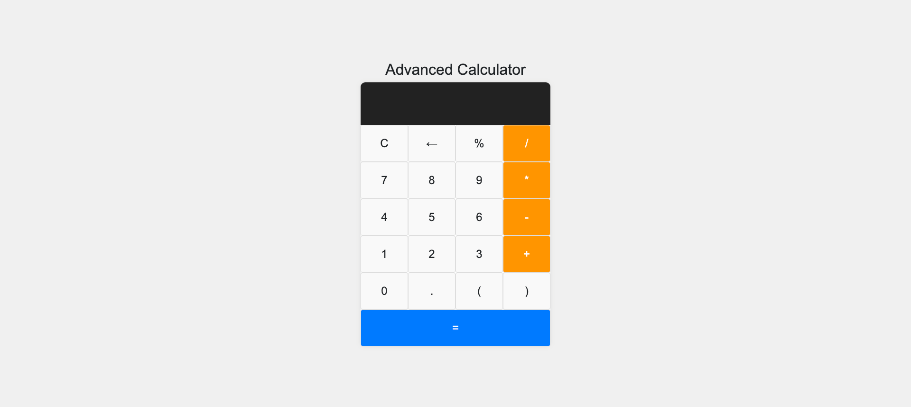

# Advanced Calculator App

An advanced calculator application built with JavaScript, HTML, and CSS. This calculator includes all standard functionalities like addition, subtraction, multiplication, and division, as well as additional features like percentage calculation, parentheses, and a clear button.



## Features

- **Basic Operations**: Addition, Subtraction, Multiplication, and Division.
- **Advanced Operations**: Percentage, Parentheses, and Decimal Point.
- **User-Friendly Interface**: Clear display and responsive buttons.
- **Backspace Functionality**: Remove the last entered character.
- **Real-time Calculations**: Immediate updates to the display as you type.

## Demo

Check out the live demo [here](#).

## Installation

1. Clone the repository:
    ```bash
    git clone https://github.com/yourusername/advanced-calculator-app.git
    ```

2. Navigate to the project directory:
    ```bash
    cd advanced-calculator-app
    ```

3. Open the `index.html` file in your browser to run the app.

## Usage

1. **Performing Calculations**:
   - Click the buttons to enter numbers and operations.
   - Use the `=` button to compute the result.
   - Use the `C` button to clear the display.
   - Use the `←` button to remove the last entered character.

2. **Advanced Functions**:
   - Use the `%` button for percentage calculations.
   - Use `(` and `)` for complex expressions with parentheses.
   - Use the `.` button for decimal points.

## Technologies Used

- HTML
- CSS
- JavaScript

## Screenshot


## Contributing

1. Fork the repository.
2. Create your feature branch (`git checkout -b feature/YourFeature`).
3. Commit your changes (`git commit -m 'Add some feature'`).
4. Push to the branch (`git push origin feature/YourFeature`).
5. Open a Pull Request.

## License

This project is licensed under the MIT License - see the [LICENSE](LICENSE) file for details.

## Acknowledgments

- Inspired by various online calculator applications.
